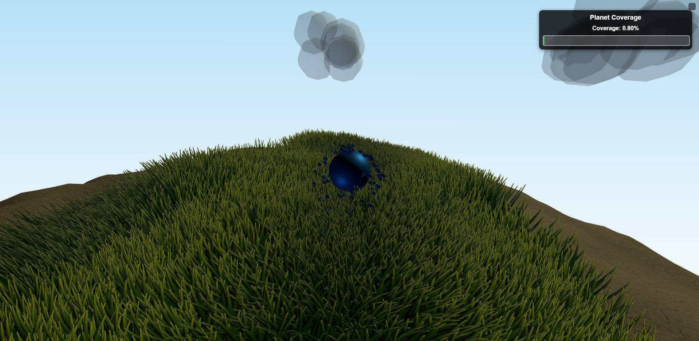

# Green Sphere



A 3D game built with Three.js where your goal is to cover a sphere with grass. This game was fully vibe coded in a day as part of a hackathon, showcasing rapid development and creative energy.

## Installation

To install and play Green Sphere, follow these steps:

1. **Clone the Repository**: Use `git clone` to download the project to your local machine.
2. **Install Node.js**: Ensure you have Node.js installed. You can download it from [nodejs.org](https://nodejs.org/).
3. **Install Dependencies**: Navigate to the project directory and run:
   ```
   npm install
   ```
   This will install all necessary packages, including Three.js and Webpack.

## Running the Game

To start playing Green Sphere:

- Run the development server with:
  ```
  npm start
  ```
  This will start the server and automatically open the game in your default browser.
- Alternatively, if you prefer to start the server without opening the browser:
  ```
  npm run dev
  ```

## Building for Production

To create a production-ready build of the game:

```
npm run build
```

This will generate optimized files in the output directory specified in `webpack.config.js`.

## How to Play

In Green Sphere, you control a sphere that emits particles. Move around the surface of a larger sphere to cover it with grass. Use the WASD keys to navigate your player and spread grass coverage across the planet.


## Dependencies

Green Sphere is built using the following key technologies:
- [Three.js](https://threejs.org/) - For 3D rendering and game graphics.
- [TypeScript](https://www.typescriptlang.org/) - For type-safe JavaScript development.
- [Webpack](https://webpack.js.org/) - For bundling and serving the application.

## License

This project is licensed under the ISC License - see the `package.json` for details or contact the author for more information.
